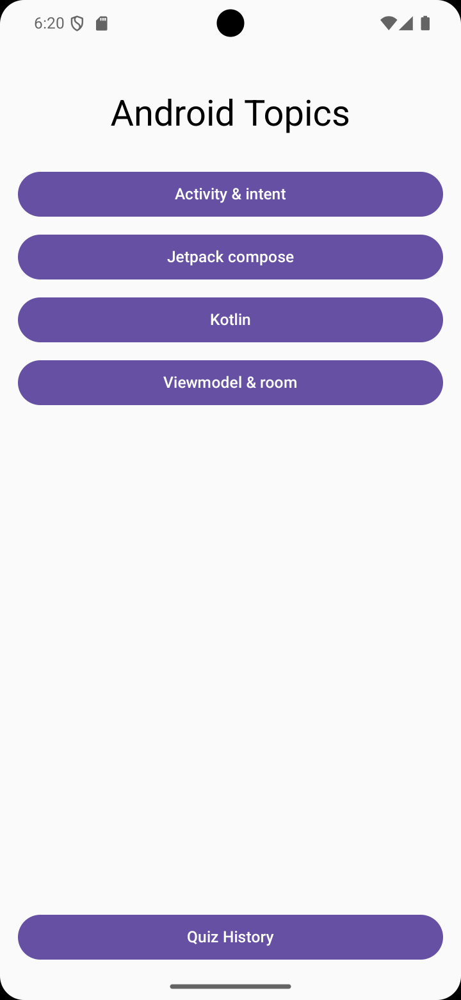
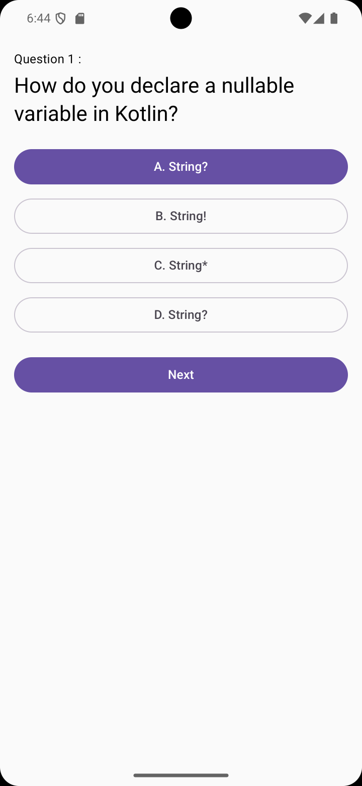
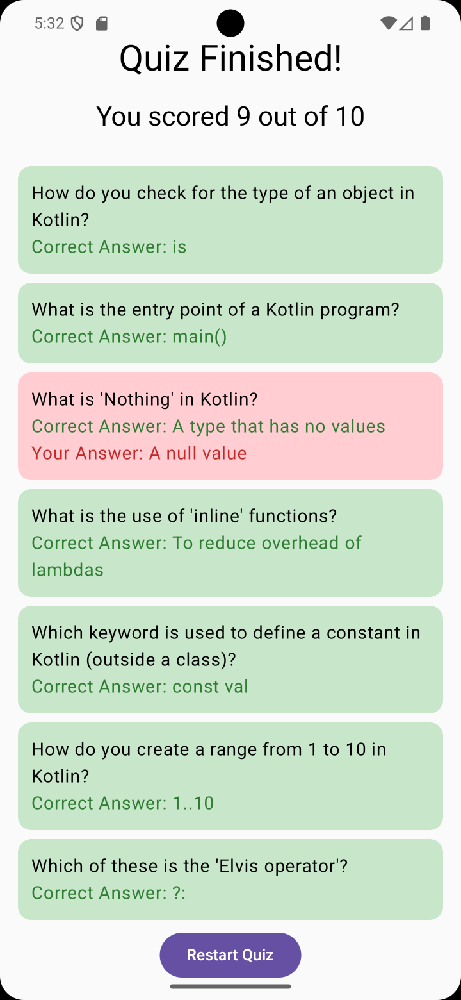
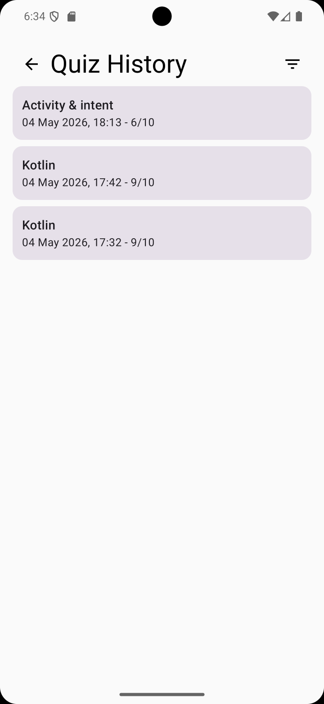
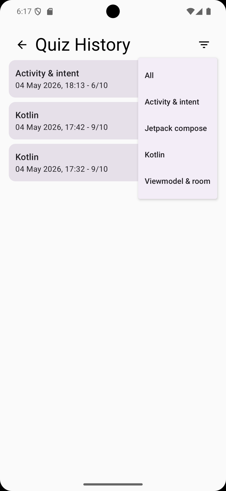
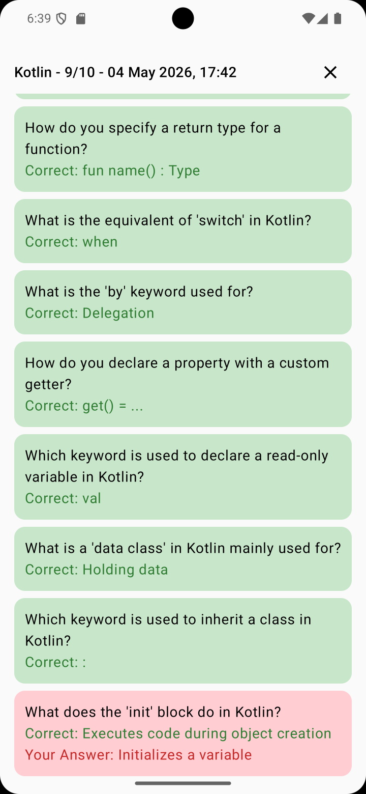

# Android Quiz App

An Android quiz application built with **Jetpack Compose** that tests knowledge across multiple Android development topics. Features topic selection, real-time scoring, colour-coded answer review, and a persistent quiz history powered by Room database.

## Screenshots

| Topic Selection | Question Screen | Summary Review |
|:---:|:---:|:---:|
|  |  |  |

| Quiz History | Filter by Topic | History Detail |
|:---:|:---:|:---:|
|  |  |  |

## Features

- **Topic Selection** — Choose from multiple Android development topics loaded dynamically from JSON assets
- **10-Question Quizzes** — Questions are shuffled and randomly selected each attempt
- **Real-Time Feedback** — Answers are colour-coded immediately after selection (green for correct, red for incorrect)
- **Summary Review** — End-of-quiz breakdown showing every question with correct and incorrect answers highlighted
- **Persistent History** — All quiz results saved to a local Room database
- **History Filtering** — Filter past results by topic using a dropdown menu
- **Detailed History View** — Tap any past quiz to review the full colour-coded question breakdown

## Architecture

The app follows the **MVVM (Model-View-ViewModel)** pattern with unidirectional data flow:

```
UI Layer (Compose Screens)
    ↕ state down / events up
Logic Layer (QuizViewModel)
    ↕
Data Layer (QuizRepository + Room Database)
```

## Tech Stack

| Layer | Technology |
|---|---|
| UI | Jetpack Compose, Material 3 |
| Navigation | Compose Navigation with NavHost |
| State Management | ViewModel, mutableStateOf, Flow |
| Database | Room (SQLite abstraction) |
| Serialization | kotlinx.serialization |
| Build | Gradle with KSP for annotation processing |

## Project Structure

```
com.dma.studentapplication/
├── data/
│   ├── Question.kt              # Data model
│   ├── QuizRepository.kt        # Loads topics and questions from JSON
│   ├── QuizResult.kt            # Room entity for quiz history
│   ├── QuizResultDao.kt         # Room DAO with Flow queries
│   └── QuizDatabase.kt          # Room database singleton
├── navigation/
│   ├── Screen.kt                # Route definitions
│   └── AppNavigation.kt         # NavHost with all routes
├── ui/screens/
│   ├── TopicListScreen.kt       # Topic selection
│   ├── QuestionScreen.kt        # Question display with answer styling
│   ├── SummaryScreen.kt         # Score and question review
│   ├── HistoryScreen.kt         # Past results with topic filter
│   └── HistoryDetailScreen.kt   # Detailed past quiz view
├── viewmodel/
│   └── QuizViewModel.kt         # State holder and business logic
└── MainActivity.kt              # Single Activity entry point
```

## Key Concepts

- Declarative UI with composable functions and modifier chains
- Navigation with route parameters and back stack management
- State management with `mutableStateOf` and `mutableStateListOf`
- Reactive data with Room `Flow` and `collectAsState`
- Data-driven design — new topics added by dropping a JSON file into assets
- Design patterns — Repository, Singleton, Observer, MVVM

## Building

1. Open the `StudentApplication` folder in Android Studio
2. Sync Gradle
3. Run on emulator or device (API 24+)
