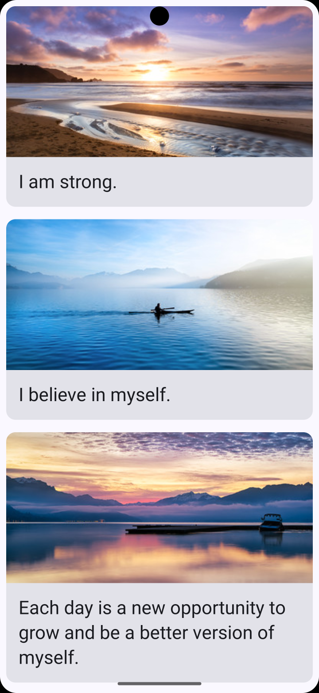
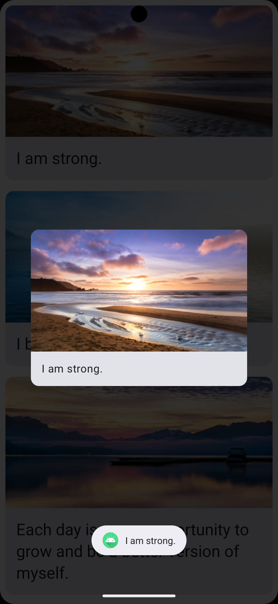
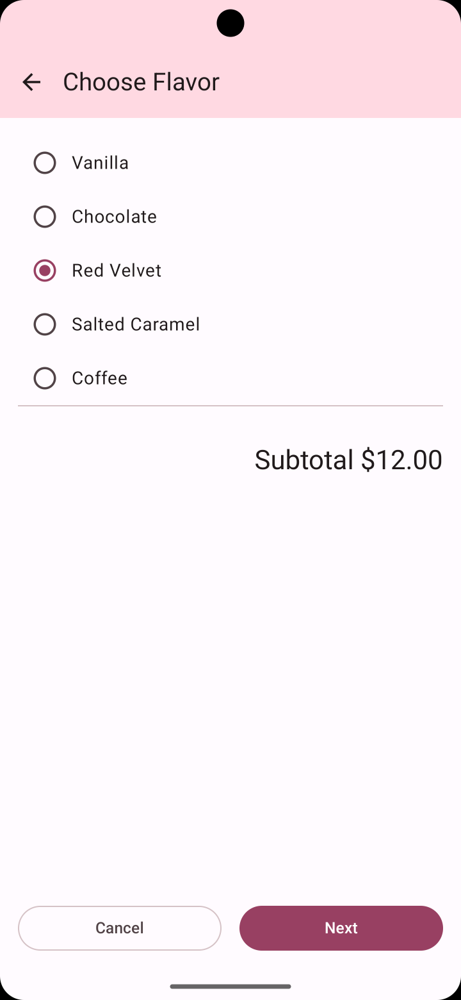
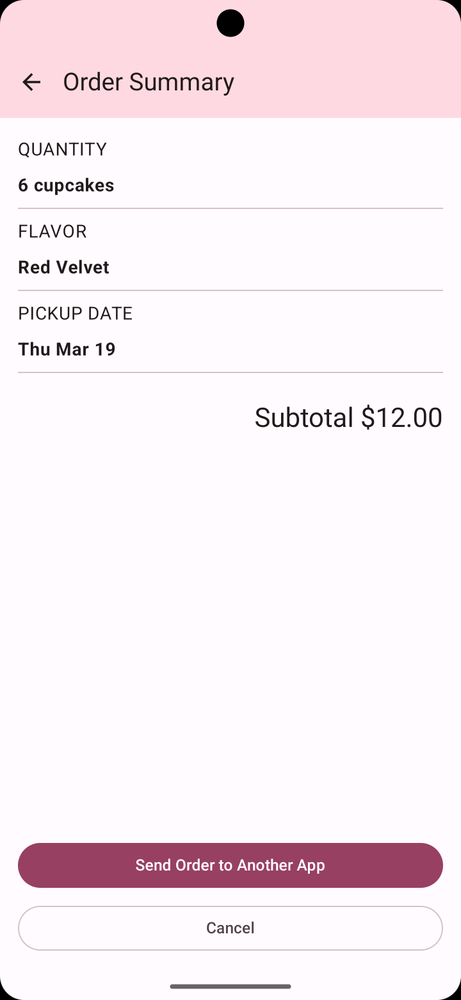
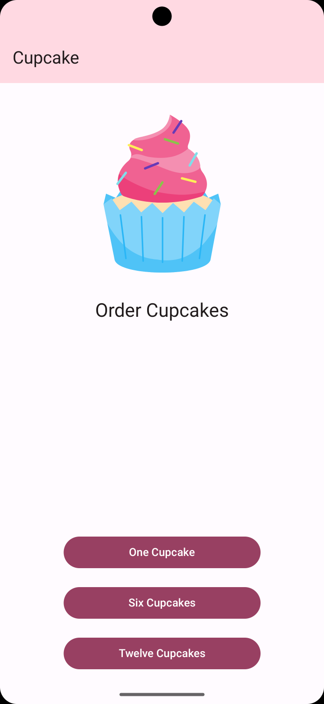
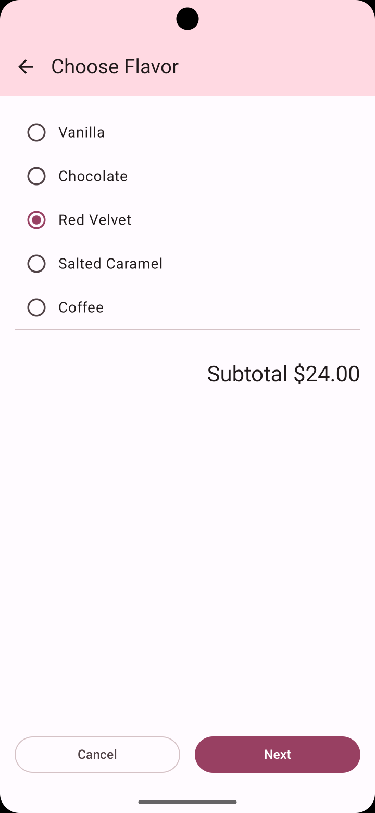
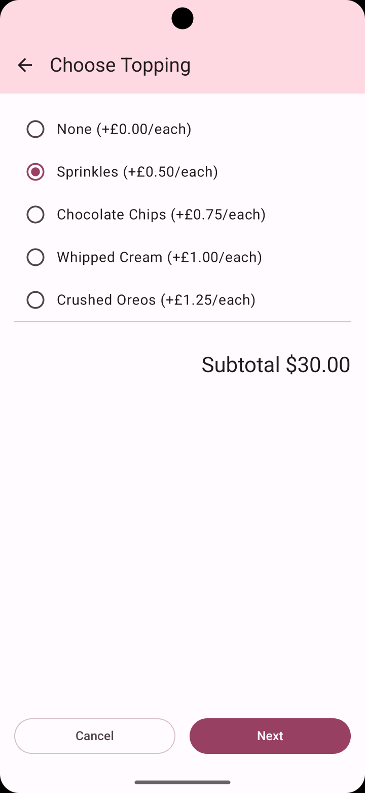
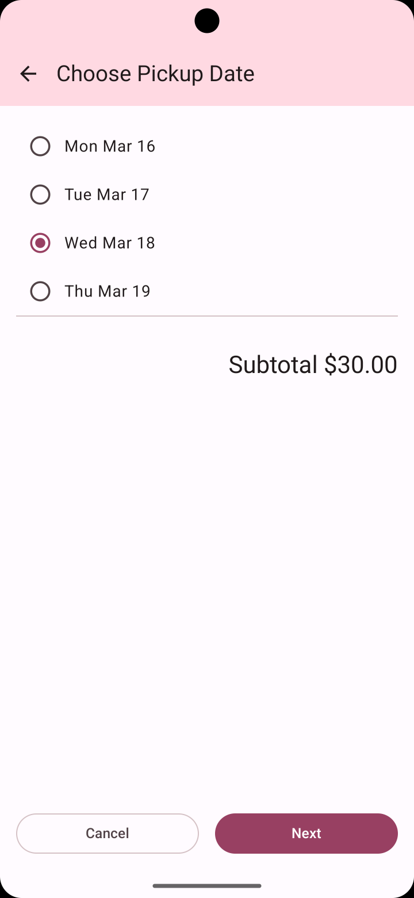
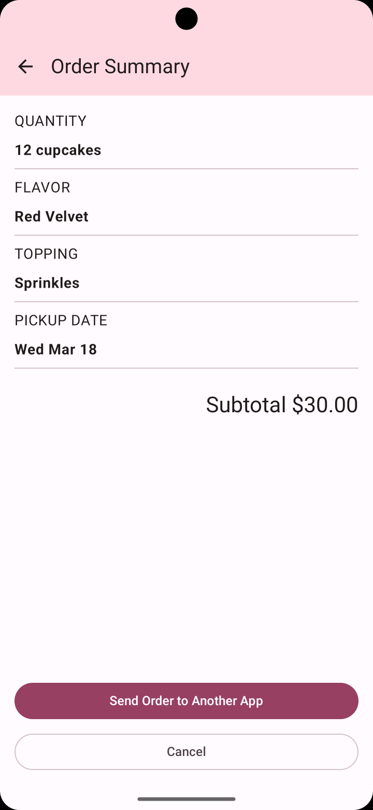

# Programming Portfolio - First Set of Exercises

*Please complete this document to confirm the work that has been done by replacing the placeholder images with screenshots.

Please replace ${\color{green}-- todo}$ with ${\color{blue}-- completed}$ once done.\
\
Include an appropriate screenshot from your application to confirm completion. Screenshots should be added to 
the /images folder in the top-level repo.\
\
 PLEASE COMMIT TO THE MAIN BRANCH
---

### Quadrants ###

|  **First Part ${\color{blue}-- completed}$**   |    **Extension ${\color{blue}-- completed}$**    |
|:-----------------------------------------------:|:--------------------------------------------:|
|  |  |

---
### Woof ###

|    **First Part LIGHT ${\color{blue}-- completed}$**    |    **First Part DARK ${\color{blue}-- completed}$**     |
|:---------------------------------------------:|:---------------------------------------------:|
|  |  |

|    **Extension LIGHT ${\color{blue}-- completed}$**    |    **Extension DARK ${\color{blue}-- completed}$**     |
|:---------------------------------------------:|:---------------------------------------------:|
|  |  |

---

### Affirmations ###

|     **First Part ${\color{blue}-- completed}$**      |      **Extension ${\color{blue}-- completed}$**      |
|:-----------------------------------------------:|:-----------------------------------------------:|
|  |  |

---

### Cupcake ###

|        **First Part 1 ${\color{blue}-- completed}$**        |         **First Part 2 ${\color{blue}-- completed}$**         |        **First Part 3 ${\color{blue}-- completed}$**         |         **First Part 4 ${\color{blue}-- completed}$**         |
|:-------------------------------------------------------:|:---------------------------------------------------------:|:--------------------------------------------------------:|:---------------------------------------------------------:|
|  |  |  |  |

|    **Extension 1 ${\color{blue}-- completed}$**    |    **Extension 2 ${\color{blue}-- completed}$**     | **Extension 3 ${\color{blue}-- completed}$**    |    **Extension 4 ${\color{blue}-- completed}$**     | **Extension 5 ${\color{blue}-- completed}$**     |
|:---------------------------------------------:|:---------------------------------------------:|:---------------------------------------------:|:---------------------------------------------:| :---------------------------------------------:|
|  |  |  |  |  |

---
